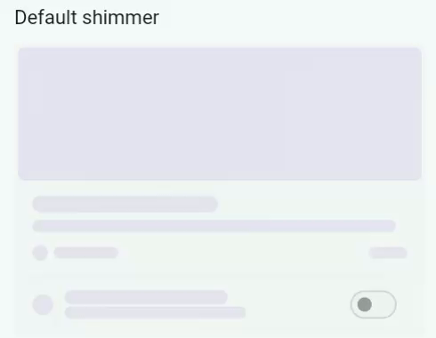
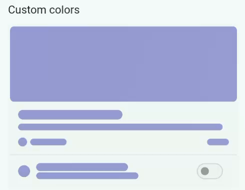
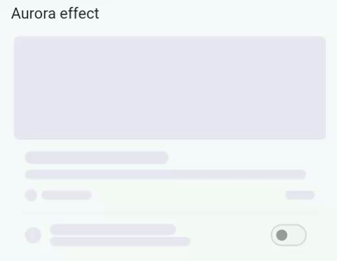
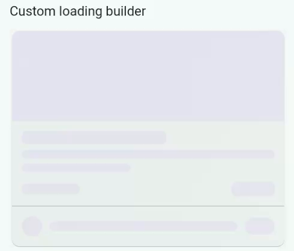

# Auto Shimmer Animate

Create animated shimmer skeleton loading states from your existing Flutter
widgets. Wrap your real UI once, pass a loading flag, and
`auto_shimmer_animate` builds the placeholder layout for you.

[](https://pub.dev/packages/auto_shimmer_animate)
[](https://pub.dev/packages/auto_shimmer_animate/score)
[](https://pub.dev/packages/auto_shimmer_animate/score)
[](https://github.com/kartikhadiya09/auto_shimmer_animate/blob/main/LICENSE)

## Preview

| Default shimmer | Custom colors | Aurora effect | Custom loading UI |
| --- | --- | --- | --- |
|  |  |  |  |

See the `example` folder for the full demo app.

## Features

- Auto skeleton generation from existing widget trees
- Built-in shimmer animation engine
- No third-party shimmer dependency
- Layered parent and child skeleton colors
- Boolean and state-based loading APIs
- Custom loading builders
- Custom shimmer wrappers
- Sweep, raw, pulse, and aurora shimmer effects
- Theme support for app-wide defaults
- Direction, duration, repeat delay, highlight opacity, and highlight width
- Child-only and block-with-child skeleton modes
- Ignore containers, images, or text when needed
- Support for common layout, text, image, icon, card, list tile, and switch tile widgets

## Installation

```yaml
dependencies:
  auto_shimmer_animate: ^0.2.1
```

```sh
flutter pub get
```

## Import

```dart
import 'package:auto_shimmer_animate/auto_shimmer_animate.dart';
```

## Basic Usage

Wrap the real widget. The same widget tree is used for both loaded and loading
states.

```dart
Widget build(BuildContext context) {
  return AutoShimmerAnimate(
    isLoading: isLoading,
    child: const ProductCard(),
  );
}
```

When `isLoading` is `false`, the original child is returned. When it is `true`,
the package renders a skeleton version and disables pointer events for the
loading placeholder.

## Loading Lists

If your list is empty while loading, provide placeholder data so the skeleton
has a shape to render.

```dart
Widget build(BuildContext context) {
  final visibleProducts = isLoading
      ? List.filled(6, Product.placeholder())
      : products;

  return AutoShimmerAnimate(
    isLoading: isLoading,
    child: ProductList(products: visibleProducts),
  );
}
```

## Custom Colors

Use separate colors for parent surfaces and child content.

```dart
Widget build(BuildContext context) {
  return AutoShimmerAnimate(
    isLoading: isLoading,
    baseColor: Colors.indigo.shade100,
    childBaseColor: Colors.indigo.shade200,
    highlightColor: Colors.white,
    child: const ProductCard(),
  );
}
```

Set `layeredSkeleton: false` when you want parent surfaces and child content to
use the same skeleton color.

```dart
Widget build(BuildContext context) {
  return AutoShimmerAnimate(
    isLoading: isLoading,
    layeredSkeleton: false,
    child: const ProductCard(),
  );
}
```

## State Based Usage

Use `AutoShimmerStateAnimate<T>` when your screen is driven by an enum, string,
or controller state instead of a boolean.

```dart
enum ViewStatus { initial, loading, loaded }

Widget build(BuildContext context) {
  return AutoShimmerStateAnimate<ViewStatus>(
    state: status,
    loadingStates: const [
      ViewStatus.initial,
      ViewStatus.loading,
    ],
    child: const ProductCard(),
  );
}
```

## Custom Loading UI

`loadingBuilder` disables automatic skeleton generation and uses your custom
loading widget instead. The returned widget still receives the shimmer layer.

```dart
Widget build(BuildContext context) {
  return AutoShimmerAnimate(
    isLoading: isLoading,
    loadingBuilder: (context, child, config) {
      return Container(
        height: 140,
        decoration: BoxDecoration(
          color: config.baseColor,
          borderRadius: config.borderRadius,
        ),
      );
    },
    child: const ProductCard(),
  );
}
```

Use `shimmerBuilder` when you want to keep automatic skeleton generation but
customize how the shimmer layer is applied.

```dart
Widget softShimmerBuilder(
  BuildContext context,
  Widget child,
  AutoShimmerConfig config,
) {
  return AutoShimmerLayer(
    config: config.copyWith(
      effect: AutoShimmerSweepEffect(
        highlightColor: Colors.teal.shade50,
        highlightOpacity: 0.8,
      ),
    ),
    child: child,
  );
}
```

## Shimmer Effects

Use the default sweep effect, or pass a custom effect.

```dart
Widget build(BuildContext context) {
  return AutoShimmerAnimate(
    isLoading: isLoading,
    effect: const AutoShimmerAuroraEffect(),
    child: const ProductCard(),
  );
}
```

Available effects:

| Effect | Use case |
| --- | --- |
| `AutoShimmerSweepEffect` | Classic directional shimmer |
| `AutoShimmerAuroraEffect` | Soft multi-color shimmer |
| `AutoShimmerPulseEffect` | Low-motion loading state |
| `AutoShimmerRawEffect` | Fully custom gradient colors and stops |

## Direction And Timing

```dart
Widget build(BuildContext context) {
  return AutoShimmerAnimate(
    isLoading: isLoading,
    direction: AutoShimmerDirection.leftToRight,
    duration: const Duration(milliseconds: 1400),
    repeatDelay: const Duration(milliseconds: 300),
    child: const ProductCard(),
  );
}
```

You can also tune `highlightOpacity` and `highlightWidth` for a softer or more
visible shimmer.

```dart
Widget build(BuildContext context) {
  return AutoShimmerAnimate(
    isLoading: isLoading,
    highlightOpacity: 0.7,
    highlightWidth: 0.3,
    child: const ProductCard(),
  );
}
```

## Skeleton Modes

Use child modes when your UI has nested cards, containers, or complex layouts.

```dart
Widget build(BuildContext context) {
  return AutoShimmerAnimate(
    isLoading: isLoading,
    onlyChildShimmer: true,
    child: const ProductCard(),
  );
}
```

```dart
Widget build(BuildContext context) {
  return AutoShimmerAnimate(
    isLoading: isLoading,
    blockChildShimmer: true,
    child: const ProductCard(),
  );
}
```

## Ignore Parts Of A Widget Tree

Keep selected widget types visible while the rest of the tree is skeletonized.

```dart
Widget build(BuildContext context) {
  return AutoShimmerAnimate(
    isLoading: isLoading,
    ignoreImages: true,
    child: const ProductCard(),
  );
}
```

```dart
Widget build(BuildContext context) {
  return AutoShimmerAnimate(
    isLoading: isLoading,
    ignoreContainers: true,
    ignoreTexts: true,
    child: const ProductCard(),
  );
}
```

This is useful for network images, branded containers, or text that should stay
visible during loading.

## Global Theme

Provide shared defaults to a subtree with `AutoShimmerTheme`.

```dart
Widget build(BuildContext context) {
  return AutoShimmerTheme(
    data: AutoShimmerConfig(
      baseColor: Colors.grey.shade200,
      childBaseColor: Colors.grey.shade300,
      highlightColor: Colors.white,
      duration: const Duration(seconds: 2),
    ),
    child: const MyApp(),
  );
}
```

Values passed directly to `AutoShimmerAnimate` override the nearest
`AutoShimmerTheme`.

## Common Tips

- Keep placeholder list lengths close to the final content length.
- Use valid image widgets or `ignoreImages: true` while data is loading.
- Use `loadingBuilder` only when you want to skip automatic skeleton generation.
- Use `shimmerBuilder` when you want to keep auto skeletons but change animation wrapping.
- Use `enabled: false` to show a static skeleton without animation.

## Example App

```sh
cd example
flutter run
```

See the `example` folder for all demos, including custom colors, effects,
state-based loading, custom loading builders, theme usage, ignore flags, and
skeleton modes.

## API Overview

| API | Description |
| --- | --- |
| `AutoShimmerAnimate` | Boolean loading wrapper that skeletonizes a child |
| `AutoShimmerStateAnimate<T>` | State-driven loading wrapper |
| `AutoShimmerTheme` | Provides global defaults to a subtree |
| `AutoShimmerConfig` | Holds colors, timing, effect, and skeleton settings |
| `AutoShimmerLayer` | Built-in shimmer renderer used by default |
| `AutoShimmerSweepEffect` | Default directional shimmer effect |
| `AutoShimmerAuroraEffect` | Multi-color aurora shimmer effect |
| `AutoShimmerPulseEffect` | Low-motion pulse effect |
| `AutoShimmerRawEffect` | Fully custom gradient shimmer effect |

## Parameters

| Parameter | Type | Default | Description |
| --- | --- | --- | --- |
| `isLoading` | `bool` | required | Shows skeleton when true |
| `child` | `Widget` | required | Widget tree to skeletonize |
| `baseColor` | `Color?` | adaptive | Parent surface skeleton color |
| `childBaseColor` | `Color?` | adaptive | Content skeleton color |
| `highlightColor` | `Color?` | `Colors.white` | Sweep highlight color |
| `highlightOpacity` | `double?` | `0.45` | Sweep highlight opacity |
| `highlightWidth` | `double?` | `0.2` | Sweep highlight band width |
| `effect` | `AutoShimmerEffect?` | sweep | Custom shimmer effect |
| `duration` | `Duration?` | `3s` | Sweep duration |
| `repeatDelay` | `Duration?` | `0ms` | Delay between sweep repeats |
| `direction` | `AutoShimmerDirection?` | diagonal | Sweep direction |
| `borderRadius` | `BorderRadius?` | `8px` | Default skeleton radius |
| `enabled` | `bool?` | `true` | Enables or disables animation |
| `layeredSkeleton` | `bool?` | `true` | Uses separate parent/content colors |
| `blockChildShimmer` | `bool?` | `false` | Paints parent blocks behind child skeletons |
| `onlyChildShimmer` | `bool?` | `false` | Paints only child/leaf skeletons |
| `ignoreContainers` | `bool` | `false` | Keeps container visuals unchanged |
| `ignoreImages` | `bool` | `false` | Keeps image widgets visible |
| `ignoreTexts` | `bool` | `false` | Keeps text widgets visible |
| `loadingBuilder` | `AutoShimmerBuilder?` | null | Custom loading UI |
| `shimmerBuilder` | `AutoShimmerBuilder?` | null | Custom shimmer wrapper |

## License

[MIT License](https://github.com/kartikhadiya09/auto_shimmer_animate/blob/main/LICENSE)
