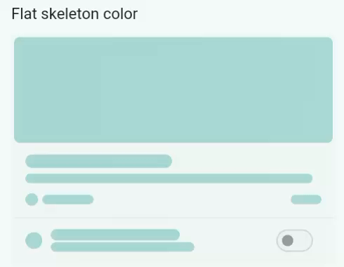
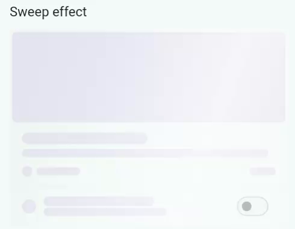
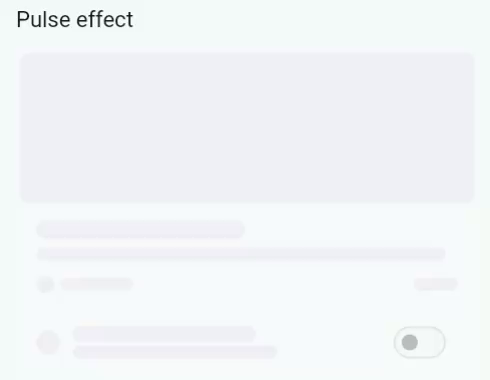
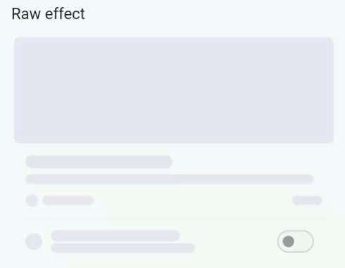
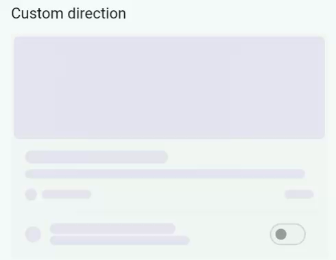
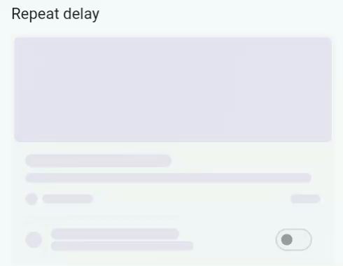
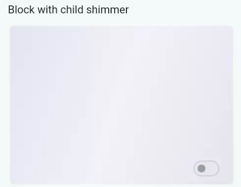
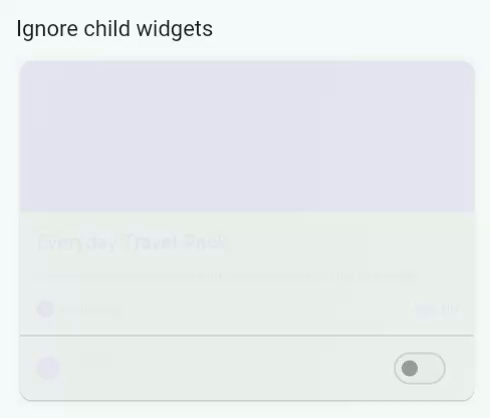
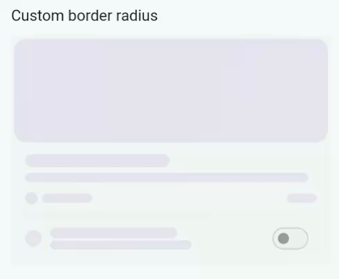

# Auto Shimmer Animate

`auto_shimmer_animate` turns your existing Flutter UI into animated skeleton
loading placeholders. Wrap the real layout once, pass a loading flag, and the
package builds the placeholder tree for you.

[](https://pub.dev/packages/auto_shimmer_animate)
[](https://pub.dev/packages/auto_shimmer_animate/score)
[](https://pub.dev/packages/auto_shimmer_animate/score)
[](https://github.com/kartikhadiya09/auto_shimmer_animate/blob/main/LICENSE)

## Introduction

Skeleton loading keeps a screen shaped like the final content while data is
being fetched. This package reduces common Flutter widgets into skeleton boxes,
text bars, image blocks, icon circles, cards, list tiles, and switch list tiles,
then paints an internal shimmer effect over the generated layout.

The goal is to avoid maintaining duplicate loading screens. Your normal UI
stays the source of truth, and the loading state follows the same spacing,
constraints, and hierarchy.

## Installation

```yaml
dependencies:
  auto_shimmer_animate: ^0.2.1
```

```sh
flutter pub get
```

## Import

```dart
import 'package:auto_shimmer_animate/auto_shimmer_animate.dart';
```

## Features

- Automatic skeleton generation from existing widget trees
- Built-in shimmer engine with no third-party shimmer dependency
- Directional sweep, raw gradient, pulse, and aurora effects
- Light and dark adaptive defaults
- Layered parent/content skeleton colors
- Boolean and state-based loading APIs
- Custom loading builders and shimmer wrappers
- Theme-level configuration with local overrides
- Support for common layout, text, image, icon, card, list tile, and switch tile widgets

When `isLoading` is `false`, the original child is returned untouched. When it
is `true`, the package builds a skeleton version and disables pointer events
and semantics for the loading placeholder.

## Use Cases

All previews use the same demo layout, so each feature can be compared against
the same widget tree.

```dart
class ProductDemoItem extends StatelessWidget {
  const ProductDemoItem({super.key});

  @override
  Widget build(BuildContext context) {
    return Card(
      clipBehavior: Clip.antiAlias,
      child: Column(
        crossAxisAlignment: CrossAxisAlignment.start,
        children: [
          Image.network(
            'https://picsum.photos/seed/auto-shimmer-item/900/420',
            height: 150,
            width: double.infinity,
            fit: BoxFit.cover,
          ),
          const Padding(
            padding: EdgeInsets.all(16),
            child: Column(
              crossAxisAlignment: CrossAxisAlignment.start,
              children: [
                Text('Everyday Travel Pack'),
                SizedBox(height: 8),
                Text('A compact weather-resistant backpack.'),
              ],
            ),
          ),
          const SwitchListTile(
            value: true,
            onChanged: null,
            title: Text('Weekly recommendations'),
            subtitle: Text('New arrivals and price drops'),
            secondary: Icon(Icons.notifications_outlined),
          ),
        ],
      ),
    );
  }
}
```

### Default shimmer

<table>
<tr>
<td width="52%">

<pre><code class="language-dart">AutoShimmerAnimate(
  isLoading: isLoading,
  child: const ProductDemoItem(),
)</code></pre>

</td>
<td width="48%">


</td>
</tr>
</table>

### Custom colors

<table>
<tr>
<td width="52%">

<pre><code class="language-dart">AutoShimmerAnimate(
  isLoading: isLoading,
  baseColor: Colors.indigo.shade100,
  childBaseColor: Colors.indigo.shade200,
  highlightColor: Colors.white,
  child: const ProductDemoItem(),
)</code></pre>

</td>
<td width="48%">


</td>
</tr>
</table>

### Flat skeleton color

<table>
<tr>
<td width="52%">

<pre><code class="language-dart">AutoShimmerAnimate(
  isLoading: isLoading,
  layeredSkeleton: false,
  baseColor: Colors.teal.shade100,
  highlightColor: Colors.white,
  child: const ProductDemoItem(),
)</code></pre>

</td>
<td width="48%">



</td>
</tr>
</table>

### Sweep effect

<table>
<tr>
<td width="52%">

<pre><code class="language-dart">AutoShimmerAnimate(
  isLoading: isLoading,
  effect: const AutoShimmerSweepEffect(
    highlightOpacity: 0.62,
    duration: Duration(milliseconds: 1600),
  ),
  child: const ProductDemoItem(),
)</code></pre>

</td>
<td width="48%">



</td>
</tr>
</table>

### Aurora effect

<table>
<tr>
<td width="52%">

<pre><code class="language-dart">AutoShimmerAnimate(
  isLoading: isLoading,
  effect: const AutoShimmerAuroraEffect(),
  child: const ProductDemoItem(),
)</code></pre>

</td>
<td width="48%">


</td>
</tr>
</table>

### Pulse effect

<table>
<tr>
<td width="52%">

<pre><code class="language-dart">AutoShimmerAnimate(
  isLoading: isLoading,
  effect: const AutoShimmerPulseEffect(),
  child: const ProductDemoItem(),
)</code></pre>

</td>
<td width="48%">



</td>
</tr>
</table>

### Raw effect

<table>
<tr>
<td width="52%">

<pre><code class="language-dart">AutoShimmerAnimate(
  isLoading: isLoading,
  effect: const AutoShimmerRawEffect(
    colors: [
      Colors.transparent,
      Color(0x26FFFFFF),
      Color(0xCCFFFFFF),
      Color(0x26FFFFFF),
      Colors.transparent,
    ],
    stops: [0, 0.25, 0.48, 0.72, 1],
    duration: Duration(milliseconds: 1700),
  ),
  child: const ProductDemoItem(),
)</code></pre>

</td>
<td width="48%">



</td>
</tr>
</table>

### Custom direction

<table>
<tr>
<td width="52%">

<pre><code class="language-dart">AutoShimmerAnimate(
  isLoading: isLoading,
  direction: AutoShimmerDirection.leftToRight,
  child: const ProductDemoItem(),
)</code></pre>

</td>
<td width="48%">



</td>
</tr>
</table>

### Repeat delay

<table>
<tr>
<td width="52%">

<pre><code class="language-dart">AutoShimmerAnimate(
  isLoading: isLoading,
  duration: const Duration(milliseconds: 1200),
  repeatDelay: const Duration(milliseconds: 500),
  child: const ProductDemoItem(),
)</code></pre>

</td>
<td width="48%">



</td>
</tr>
</table>

### Block with child shimmer

<table>
<tr>
<td width="52%">

<pre><code class="language-dart">AutoShimmerAnimate(
  isLoading: isLoading,
  blockChildShimmer: true,
  child: const ProductDemoItem(),
)</code></pre>

</td>
<td width="48%">



</td>
</tr>
</table>

### Custom loading builder

<table>
<tr>
<td width="52%">

<pre><code class="language-dart">AutoShimmerAnimate(
  isLoading: isLoading,
  loadingBuilder: _loadingBuilder,
  child: const ProductDemoItem(),
)</code></pre>

</td>
<td width="48%">


</td>
</tr>
</table>

### Ignore child widgets

<table>
<tr>
<td width="52%">

<pre><code class="language-dart">AutoShimmerAnimate(
  isLoading: isLoading,
  ignoreContainers: true,
  ignoreImages: true,
  ignoreTexts: true,
  child: const ProductDemoItem(),
)</code></pre>

</td>
<td width="48%">



</td>
</tr>
</table>

### Custom border radius

<table>
<tr>
<td width="52%">

<pre><code class="language-dart">AutoShimmerAnimate(
  isLoading: isLoading,
  borderRadius: BorderRadius.circular(18),
  child: const ProductDemoItem(),
)</code></pre>

</td>
<td width="48%">



</td>
</tr>
</table>

### Code-only tabs

Some example tabs do not need a separate GIF because they use the same visual
layout and are mainly API variations.

```dart
// Highlight tab
AutoShimmerAnimate(
  isLoading: isLoading,
  highlightOpacity: 0.78,
  highlightWidth: 0.32,
  child: const ProductDemoItem(),
)

// Child tab
AutoShimmerAnimate(
  isLoading: isLoading,
  onlyChildShimmer: true,
  child: const ProductDemoItem(),
)

// Disabled tab
AutoShimmerAnimate(
  isLoading: isLoading,
  enabled: false,
  child: const ProductDemoItem(),
)
```

```dart
// Ignore Box tab
AutoShimmerAnimate(
  isLoading: isLoading,
  ignoreContainers: true,
  child: const ProductDemoItem(),
)

// Ignore Image tab
AutoShimmerAnimate(
  isLoading: isLoading,
  ignoreImages: true,
  child: const ProductDemoItem(),
)

// Ignore Text tab
AutoShimmerAnimate(
  isLoading: isLoading,
  ignoreTexts: true,
  child: const ProductDemoItem(),
)
```

```dart
// Builder tab
AutoShimmerAnimate(
  isLoading: isLoading,
  shimmerBuilder: _softShimmerBuilder,
  child: const ProductDemoItem(),
)

// State tab
AutoShimmerStateAnimate<ViewStatus>(
  state: status,
  loadingStates: const [
    ViewStatus.initial,
    ViewStatus.loading,
  ],
  child: const ProductDemoItem(),
)

// Theme tab
AutoShimmerTheme(
  data: AutoShimmerConfig(
    baseColor: Colors.orange.shade100,
    childBaseColor: Colors.orange.shade200,
    highlightColor: Colors.white,
    duration: const Duration(milliseconds: 1300),
  ),
  child: AutoShimmerAnimate(
    isLoading: isLoading,
    child: const ProductDemoItem(),
  ),
)
```

## Provide Layout Data

The package needs a widget tree to skeletonize. If your list is empty while
loading, provide temporary placeholder items so the layout has a shape.

```dart
final visibleProducts = isLoading
    ? List.filled(6, Product.placeholder())
    : products;

AutoShimmerAnimate(
  isLoading: isLoading,
  child: ProductList(products: visibleProducts),
)
```

For network images, avoid invalid URLs during loading by passing an empty image
widget, a local placeholder, or `ignoreImages: true`.

```dart
AutoShimmerAnimate(
  isLoading: isLoading,
  ignoreImages: true,
  child: ProductCard(product: product),
)
```

## Colors

`baseColor` paints parent surfaces such as cards and containers.
`childBaseColor` paints content such as text, images, and icons when
`layeredSkeleton` is enabled. `highlightColor` controls the moving shimmer
overlay. A short custom-color example is shown in the Use Cases section.

## Effects

### Sweep

```dart
AutoShimmerAnimate(
  isLoading: isLoading,
  effect: const AutoShimmerSweepEffect(
    highlightColor: Colors.white,
    highlightOpacity: 0.45,
    highlightWidth: 0.2,
    duration: Duration(seconds: 3),
  ),
  child: ProductCard(product: product),
)
```

### Pulse

```dart
AutoShimmerAnimate(
  isLoading: isLoading,
  effect: const AutoShimmerPulseEffect(),
  child: ProductCard(product: product),
)
```

Use `AutoShimmerRawEffect` when you want full control over gradient colors,
stops, alignments, bounds, and duration.

## Direction And Timing

```dart
AutoShimmerAnimate(
  isLoading: isLoading,
  direction: AutoShimmerDirection.leftToRight,
  duration: const Duration(milliseconds: 1400),
  repeatDelay: const Duration(milliseconds: 120),
  child: ProductCard(product: product),
)
```

`enabled: false` keeps the generated skeleton visible without running the
animation.

## Global Theme

```dart
AutoShimmerTheme(
  data: const AutoShimmerConfig(
    baseColor: Color(0xFFE6E8EF),
    childBaseColor: Color(0xFFD6DAE2),
    effect: AutoShimmerAuroraEffect(),
  ),
  child: MyApp(),
)
```

Values passed directly to `AutoShimmerAnimate` override the nearest
`AutoShimmerTheme`.

## State-Based Usage

Use `AutoShimmerStateAnimate<T>` when your screen is driven by enum, string, or
object states instead of a boolean loading flag. A short state-based example is
shown in the Use Cases section.

## Custom Builders

Use `loadingBuilder` to skip automatic skeleton generation and provide your own
loading UI. The returned widget still receives the default shimmer layer.

```dart
AutoShimmerAnimate(
  isLoading: isLoading,
  loadingBuilder: (context, _, config) {
    return SizedBox(
      height: 120,
      child: DecoratedBox(
        decoration: BoxDecoration(
          color: config.baseColor,
          borderRadius: config.borderRadius,
        ),
      ),
    );
  },
  child: ProductCard(product: product),
)
```

Use `shimmerBuilder` to replace how the generated skeleton is animated. A short
`shimmerBuilder` example is shown in the Use Cases section.

## Example App

```sh
cd example
flutter pub get
flutter run
```

The example includes a single shared product item wrapped by each package
feature: colors, effects, direction, delay, child modes, builders, state,
theme, ignore flags, and border radius.

## API Overview

| API | Description |
| --- | --- |
| `AutoShimmerAnimate` | Boolean loading wrapper that skeletonizes a child |
| `AutoShimmerStateAnimate<T>` | State-driven loading wrapper |
| `AutoShimmerTheme` | Provides global defaults to a subtree |
| `AutoShimmerConfig` | Holds colors, timing, effect, and skeleton settings |
| `AutoShimmerLayer` | Built-in shimmer renderer used by default |
| `AutoShimmerSweepEffect` | Default directional shimmer effect |
| `AutoShimmerAuroraEffect` | Multi-color aurora shimmer effect |
| `AutoShimmerPulseEffect` | Low-motion pulse effect |
| `AutoShimmerRawEffect` | Fully custom gradient shimmer effect |

## Parameters

| Parameter | Type | Default | Description |
| --- | --- | --- | --- |
| `isLoading` | `bool` | required | Shows skeleton when true |
| `child` | `Widget` | required | Widget tree to skeletonize |
| `baseColor` | `Color?` | adaptive | Parent surface skeleton color |
| `childBaseColor` | `Color?` | adaptive | Content skeleton color |
| `highlightColor` | `Color?` | `Colors.white` | Sweep highlight color |
| `highlightOpacity` | `double?` | `0.45` | Sweep highlight opacity |
| `highlightWidth` | `double?` | `0.2` | Sweep highlight band width |
| `effect` | `AutoShimmerEffect?` | sweep | Custom shimmer effect |
| `duration` | `Duration?` | `3s` | Sweep duration |
| `repeatDelay` | `Duration?` | `0ms` | Delay between sweep repeats |
| `direction` | `AutoShimmerDirection?` | diagonal | Sweep direction |
| `borderRadius` | `BorderRadius?` | `8px` | Default skeleton radius |
| `enabled` | `bool?` | `true` | Enables or disables animation |
| `layeredSkeleton` | `bool?` | `true` | Uses separate parent/content colors |
| `blockChildShimmer` | `bool?` | `false` | Paints parent blocks behind child skeletons |
| `onlyChildShimmer` | `bool?` | `false` | Paints only child/leaf skeletons |
| `ignoreContainers` | `bool` | `false` | Keeps container visuals unchanged |
| `ignoreImages` | `bool` | `false` | Keeps image widgets visible |
| `ignoreTexts` | `bool` | `false` | Keeps text widgets visible |
| `loadingBuilder` | `AutoShimmerBuilder?` | null | Custom loading UI |
| `shimmerBuilder` | `AutoShimmerBuilder?` | null | Custom shimmer wrapper |

## License

[MIT License](https://github.com/kartikhadiya09/auto_shimmer_animate/blob/main/LICENSE)
